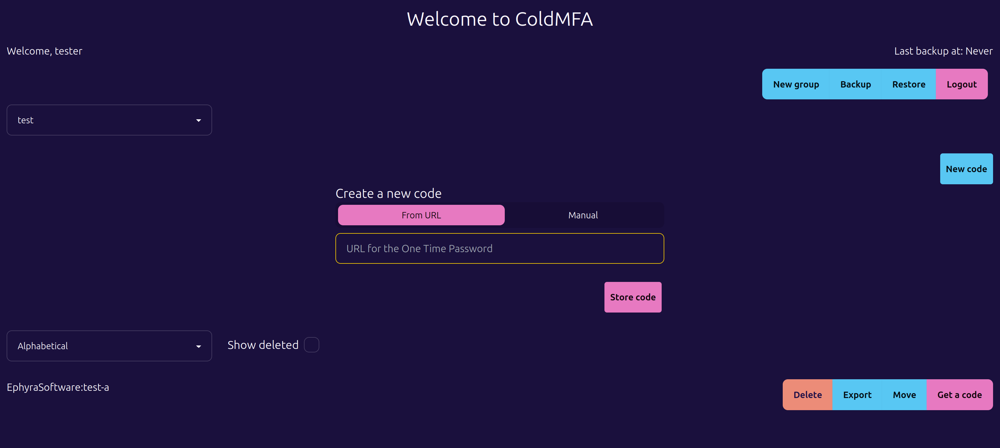

# Locus

Apps for your intranet

### ColdMFA

An app for storing your MFA codes.

### Useful documentation for working on this project

- [Caddy](https://caddyserver.com/docs/)
- [Ory Kratos](https://www.ory.sh/docs/welcome)
- [Age encryption](https://github.com/FiloSottile/age)
- [Mock service worker](https://mswjs.io/docs/)
- [Vitest guide](https://vitest.dev/guide/)
- [Vue test utils](https://test-utils.vuejs.org/guide/)
- [DaisyUI](https://daisyui.com/docs/install/)
- [Pinia](https://pinia.vuejs.org/)
- [OTP for Go](https://github.com/pquerna/otp)
- [OTP spec](https://github.com/google/google-authenticator/wiki/Key-Uri-Format)
- [Axios](https://axios-http.com/)
- [Tailwind](https://tailwindcss.com/docs/installation)
- [Vue 3](https://vuejs.org/guide/introduction.html)
- [Fiber](https://docs.gofiber.io/)
- [Migrate](https://github.com/golang-migrate/migrate)
- [Ory Kratos production deploy](https://www.ory.sh/docs/kratos/guides/deploy-kratos-example)
